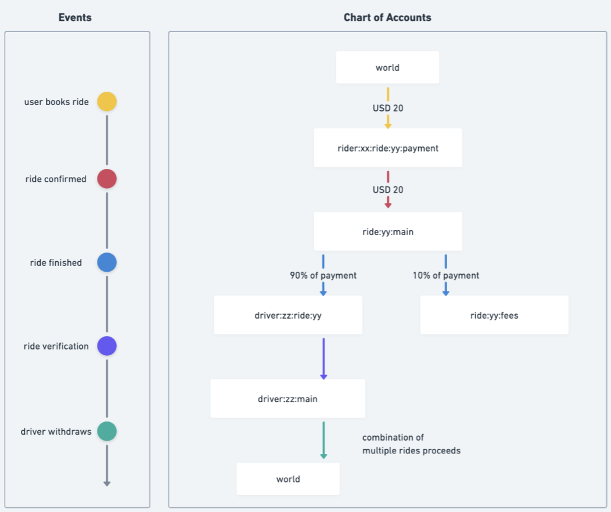

In this tutorial, we will set up and use Formance Ledger for a ride-sharing platform called "RideShare." We will design a Chart of Accounts, use NumScript to execute transactions that reflect the financial activities of the platform, and checking account balances.

## Prerequisites

Before you begin, ensure you have completed the following steps:

1. **Install fctl**: Verify that you have installed the Formance Command Line Tool (fctl) on your machine. You can check this by running:
    
    ```bash
    fctl version
    ```
    
    If fctl is not installed, refer to [Installing the Formance CLI](https://docs.formance.com/getting-started/fctl-quick-start).
    
2. [**Create a Sandbox**](https://docs.formance.com/guides/newSandbox): The sandbox will allow you to test and experiment with Formance Ledger without affecting any production data. 

## Design the Chart of Accounts

The [Chart of Accounts](https://docs.formance.com/ledger/advanced/scale#chart-of-accounts) should reflect all account types relevant to your flow of funds and reporting needs. 

We recommend starting with the key questions you need the ledger to answer to help you design the Chart of Accounts. For RideShare, the key questions are:

- How much did we pay the drivers?
- How much did we collect in service fees?
- How much did an individual rider pay?
- How much did an individual driver earn?

And key events we need the ledger to support:

- User books a ride
- RideShare confirms the ride
- Driver finishes the ride
- RideShare completes ride verification
- (After some days) Driver requests earnings withdrawal

To support the key questions and events, we need the following Chart of Accounts:



Here’s an explanation of the accounts:

| Account | Explanation |
| --- | --- |
| `@world` | The `@world` account in the Formance Ledger represents the external world and is used to record funds entering and exiting the ledger from outside. |
| `rider:xx:ride:yy:payment` | Records the estimated amount the rider xx will be charged for the ride yy. |
| `ride:yy:main` | Records the amount charged for the ride yy.  |
| `driver:zz:ride:yy` | Records the amount owed to driver zz for ride yy on successful ride verification. |
| `ride:yy:fees` | Records the amount RideShare collected in service fees overall. |
| `driver:zz:main` | Records the total earnings for driver zz that will eventually be paid out to the driver. |

The structured [naming convention](https://docs.formance.com/ledger/reference/accounting-model#naming-accounts) helps organize accounts into segments, making it easier to manage and query them while focusing on the key financial activities of the ride-sharing platform. 

Now that we have the Chart of Accounts, let’s design the transactions for RideShare.

## Introduce money into the Ledger

When a rider books a ride, we record the estimated payment they will be charged on completion of the ride in an account for that ride. To introduce initial capital into the ride-sharing platform, we record funds from an external source (`@world`) to our account for the ride payment (`@rider:xx:ride:yy:payment`) using [Numscript](https://docs.formance.com/numscript/). 

Create a Numscript file named `intro.num` using the [Unambiguous Monetary Notation](https://docs.formance.com/stack/unambiguous-monetary-notation) to represent monetary value:

```numscript
send [USD/2 2000] (
  source = @world
  destination = @rider:xx:ride:yy:payment
)
```

Execute this transaction using fctl:

```shell
fctl ledger transactions num intro.num
```

This will add $20 to the `@rider:xx:ride:yy:payment` account.

Note: If you have more than one sandbox, specify which one to send the transactions to:

```shell
fctl ledger transactions --stack <sandbox_id> num intro.num
```

## Run transactions on the Ledger

The next event that occurs is the ride confirmation, which is when we transfer the recorded amount from `@rider:xx:ride:yy:payment` to the main account for the ride (`@ride:yy:main`). Create and execute a new Numscript file named `payment.num`:

```numscript
send [USD/2 2000] (
  source = @rider:xx:ride:yy:payment
  destination = @ride:yy:main
)
```

```shell
fctl ledger transactions num payment.num
```

After the ride is completed, we divide the payment amount between the driver earnings account for the ride (`driver:zz:ride:yy`) and the account representing the service fees collected by RideShare (`ride:yy:fees`). Create and execute a new Numscript file named `payment_split.num`:

```numscript
send [USD/2 2000] (
  source = @ride:yy:main
  destination = {
    10% to @ride:yy:fees
    remaining to @driver:zz:main
  }
)
```

```shell
fctl ledger transactions num payment_split.num
```

RideShare then verifies the ride and transfers the record for the driver earnings to the driver’s overall earnings account (`driver:zz:main`).

After some days, the driver will request their earnings to be withdrawn, which is when RideShare transfers the record of the driver’s earnings back to `@world` to represent funds leaving the ledger. Create and execute a new Numscript file named `driver_payment.num`:

```numscript
send [USD/2 *] (
  source = @driver:zz:main
  destination = @world
)
```

```shell
fctl ledger transactions num driver_payment.num
```

## Check account balances

You can check the balances of the accounts using the [Formance Console](https://portal.formance.cloud).