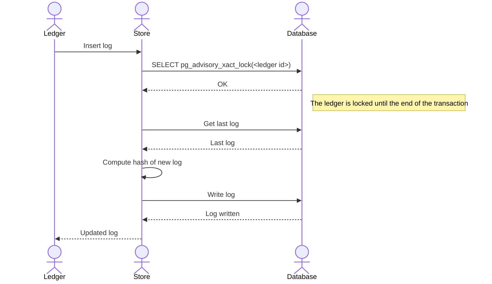

# Performance model

This document explains the performance characteristics of Formance Ledger and provides guidance on optimizing your deployment for better performance.

## Performance characteristics

The ledger's performance is affected by various factors, with different operations having different complexity models:

| Operation | Complexity model | Description |
| --- | --- | --- |
| Transaction commit | O(N) + W | Linear scaling with number of postings (N) plus write overhead (W) |
| Balance aggregation | O(Log(N)*M) | Logarithmic scaling with number of accounts (N) times number of assets (M) |
| Point query (accounts/transactions) | O(1) | Constant time lookup using primary keys |
| Range query (accounts/transactions) | O(Log(N)) | Logarithmic scaling with size of data set |

### Transaction processing performance

Transaction processing performance is primarily influenced by:

1. **Number of postings**: Performance scales linearly with the number of postings in a transaction.
2. **Feature configuration**: Enabled features add processing overhead (see [Feature impact](#feature-impact)).
3. **Database performance**: The underlying PostgreSQL database affects transaction throughput.
4. **Concurrency**: Multiple transactions attempting to modify the same accounts can cause locking contention.

### Query performance

Query performance depends on:

1. **Index usage**: The ledger uses PostgreSQL indexes to optimize queries.
2. **Result set size**: Larger result sets require more processing time and memory.
3. **Filter complexity**: Complex query filters can reduce performance.

## Feature impact

The ledger's performance can be significantly affected by the enabled features:

### Hash system

When the `HASH_LOGS` feature is enabled:
- Each log is cryptographically linked to the previous log
- Advisory locks are used to ensure hash chain integrity
- This can become a bottleneck for high write throughput



### Movement tracking

When the `MOVES_HISTORY` feature is enabled:
- Individual fund movements are tracked in the database
- This adds overhead for transaction processing
- The `MOVES_HISTORY_POST_COMMIT_EFFECTIVE_VOLUMES` feature adds further overhead for updating effective volumes

## Scaling strategies

As your transaction volumes grow, consider these scaling approaches:

### Multiple ledgers

Distribute data across multiple ledgers based on logical business divisions:
- Each ledger operates independently
- Data can be queried across ledgers if needed
- Reduces contention on single ledger resources

### Buckets

Ledgers use PostgreSQL schemas (buckets) for data isolation:
- Default bucket is named `_default`
- Custom buckets can be created for different data sets
- Allows for physical data separation

### Parallelism

The ledger supports parallel processing for certain operations:
```go
b.SetParallelism(int(parallelismFlag))
```
This improves throughput on multi-core systems by processing multiple operations concurrently.

## Performance testing

Formance provides tools to benchmark your specific deployment:

### Benchmark suite

The benchmark suite measures:
1. **Transactions Per Second (TPS)**: How many transactions the ledger can process per second
2. **Latency**: Time to process a single transaction (milliseconds)

### Running benchmarks

To run benchmarks against your deployment:

```shell
# Run locally
earthly +run

# Run against a remote stack
earthly +run --args="--stack.url=XXX --client.id=XXX --client.secret=XXX"

# Run against a remote ledger
earthly +run --args="--ledger.url=XXX --auth.url=XXX --client.id=XXX --client.secret=XXX"
```

### Custom benchmarks

You can customize the benchmark suite to test your specific transaction patterns:
- Test scripts are located in the `/test/performance/scripts` directory
- Each script defines a transaction pattern to benchmark
- Available patterns include transfers between world and specific accounts, bounded and unbounded transactions

## Performance optimization recommendations

### For high-throughput applications

1. Disable features you don't need:
   - `HASH_LOGS`: Disable if audit trails are not critical
   - `MOVES_HISTORY`: Disable if individual fund movement tracking is not required

2. Optimize transaction structure:
   - Group related operations into single transactions
   - Minimize the number of postings per transaction
   - Avoid modifying the same accounts in concurrent transactions

3. Configure your database:
   - Ensure adequate CPU and memory resources
   - Optimize PostgreSQL for your workload (connection pooling, memory settings)
   - Use SSDs for storage

### For multi-instance deployments

1. Implement proper load balancing across instances
2. Add retry logic for 409 Conflict responses
3. Consider using Redis-based shared locks to reduce conflicts

## Monitoring performance

Monitor these key metrics:
1. **Transaction throughput**: Transactions per second
2. **Transaction latency**: Time to process individual transactions
3. **Conflict rate**: Frequency of 409 Conflict responses
4. **Database metrics**: CPU, memory, disk I/O, connection count
