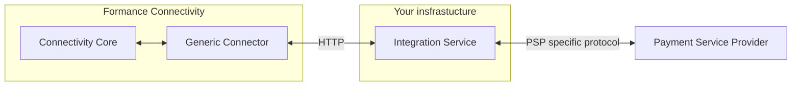
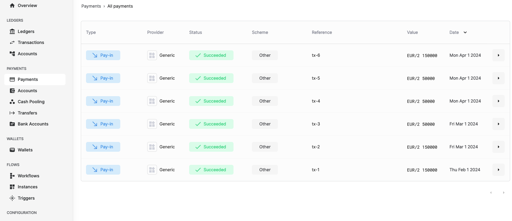

# Getting started with the Generic Connector

The Generic Connector for Formance Connectivity provides a way to connect your Formance Stack with Financial Service Providers that are not natively supported by Formance.

In this tutorial, you will learn how to use the Generic Connector to connect your Formance Stack with a fake Payment Service Provider that will return static fake data.

The generic connector interacts with a Payment Service Provider by sending requests formatted according to the [Generic Connector API specifications](./api-reference) to an endpoint that you need to develop and provide. This endpoint acts as a middleware. It will query the Financial Institution and return the data in the expected format as shown in the diagram below.



## Prerequisites

Before you begin, you need to have a sandbox stack running. If you don't have one, you can create one by following the [Getting started with Formance](../../../getting-started/fctl-quick-start.mdx) guide.

## Setup

For the purpose of this tutorial, we will use static data provided by a remote server created for this tutorial. The server is available at the following URL: `https://wo4o67kza53yyfxbqkxnpjkknm0mndbb.lambda-url.eu-west-1.on.aws`.

To install the Generic Connector, you need to create a `generic-connector.json` file that contains the configuration of the connector. The configuration file should look like this:

```json title='generic-connector.json'
{
  "name": "generic-tutorial",
  "apiKey": "fake-api-key",
  "endpoint": "https://wo4o67kza53yyfxbqkxnpjkknm0mndbb.lambda-url.eu-west-1.on.aws",
  "pollingPeriod": "1h"
}
```

Then, apply the configuration to your stack by running the following command:

```bash
fctl payments connectors install generic generic-connector.json
```

You should see a similar output:

```
You are about to install connector 'generic'.
Do you want to continue [Y/n]y
 SUCCESS  generic: connector 'eyJQcm92aWRlciI6IkdFTkVSSUMiLCJSZWZlcmVuY2UiOiI2NzI5YjI5NS00MGZmLTQzOWQtOTU1NS1mNTYwN2M2MzAzODUifQ' installed!
```

## Explore the data

Now that the connector is installed, you can explore the data that has been imported into Formance Connectivity.

First, open the console.

```bash
fctl ui
```

Navigate to the Connectivity page. You should see a list of payments that have been imported from the fake Payment Service Provider.



:::note
If you don't see any transactions but a welcome page, click on the `Refresh status` button to reload the data.
:::

Congratulations! You have successfully imported payments data into Formance Connectivity using the Generic Connector.
