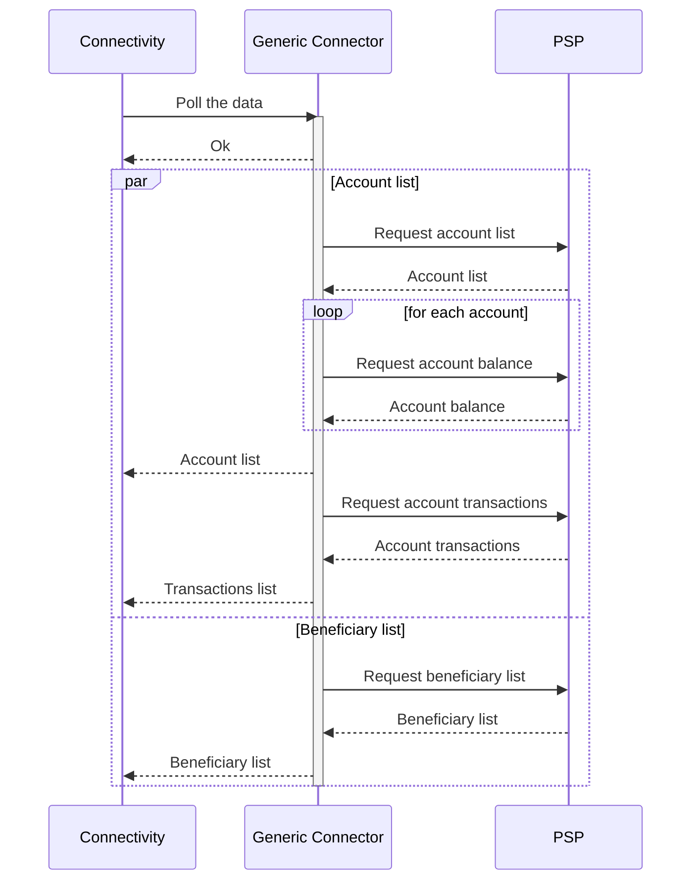
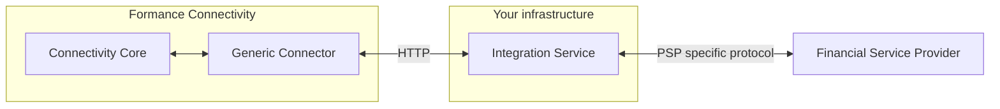

# How does the Generic Connector work?

The Generic Connector for Formance Connectivity provides a way to connect your Formance Stack with Financial Service Providers that are not natively supported by Formance.

Formance Connectivity interact with the remote Financial Service Provider, throught the Generic Connector, as follow:

The Generic Connector is in charge of polling the data from the Financial Service Provider, and then it sends the data to the Formance Connectivity. It polls the following data:

- the list of accounts available in the Financial Service Provider and their associated balances and transactions.
- the list of beneficiaries available in the Financial Service Provider for payouts.

## Integration with the Financial Service Provider

The Generic Connector interacts with the Financial Service Provider by sending request formatted according to the [Generic Connector API specifications](./api-reference) and expecting responses formatted according to the same specifications.

As a consequence, it is necessary to create a service on your side that will interact with the Financial Service Provider and expose the data with the expected format.

The typical deployment of the Generic Connector is as follows:

## Authentication

When instanciating the Generic Connector, you will need to pass an API key that will be used to authenticate the requests to your service. The Generic Connector will send requests with the api key in the `Authorization` header so that your service can authenticate the requests.
