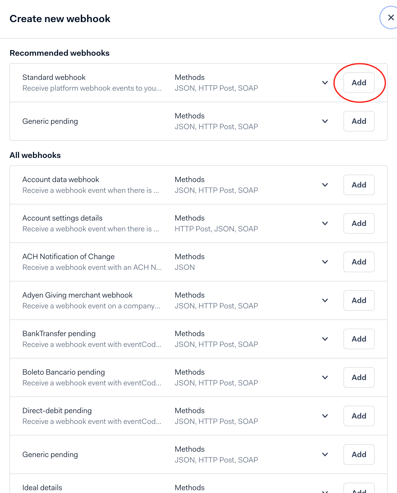
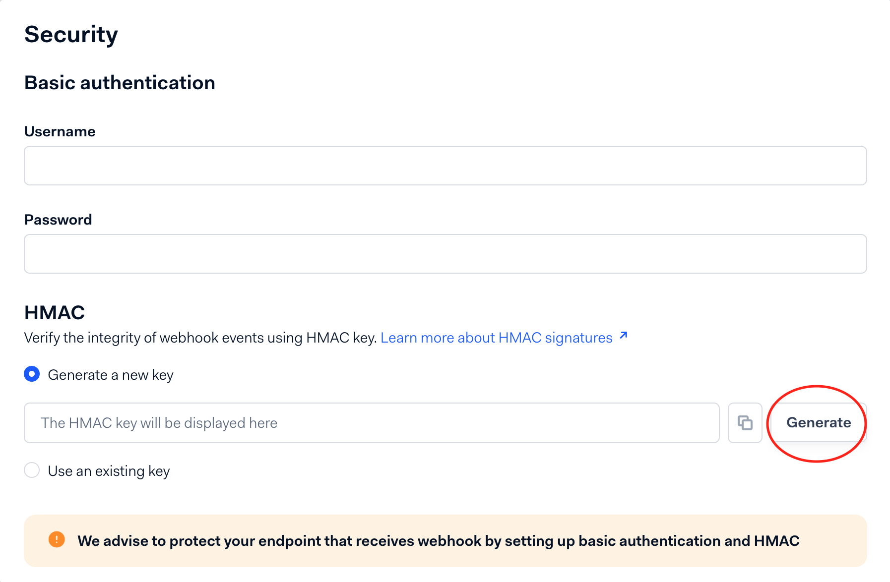

import {StackCmd} from '@site/src/components/StackCmd';
import ApiWarning from '@site/docs/payments/partials/_api_key.mdx';

## Prerequisites

Before you begin, you need to have a Adyen account. If you don't have one, you can [sign up for a Adyen account](https://www.adyen.com/) here.

<ApiWarning/>

## Setup

In order to use the adyen connector, you will have first to create a webhook in
your Adyen account. First, you need to go to Developers > Webhooks in your Adyen
account and click on the button to add a new standard webhook.



Then, on the webhook creation page, you need to first generate a new HMAC key.



Copy the HMAC key and paste it in the `hmacKey` field in the JSON configuration
for the formance connector. You can now create the connector on the Formance
platform using the following command:

<StackCmd>

```shell
fctl payments connectors install atlar adyen.json
```

```shell
curl -X POST "https://$STACK.formance.cloud/api/payments/connectors/atlar" \
-H "Content-Type: application/json" \
-H "Authorization: Bearer $TOKEN" \
-d @adyen.json
```

</StackCmd>

With adyen.json containing:

```json
{
    "name": "adyen",
    "apiKey": "<apiKey>",
    "hmacKey": "<hmacKey>",
    "liveEndpointPrefix": "<liveEndpointPrefix>",
    "pollingPeriod": "2m"
}
```

Retrieve the connector ID after creation, you will need it to link the connector
to the webhook in Adyen.

Finally, you can add the URL in the server configuration in the webhook creation
page on Adyen. The URL must have the following format:

```
https://$STACK.formance.cloud/api/payments/connectors/webhooks/adyen/<connectorID>/
```

You can now save the configuration and wait for webhooks to start coming in.