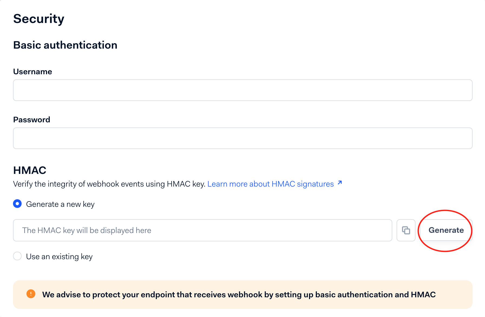

In order to use the adyen connector, you will have to create a webhook in
your Adyen account. You need to go to Developers > Webhooks in your Adyen
account and click on the button to add a new standard webhook.

Then, on the webhook creation page, you need to first generate a new HMAC key.

Copy the HMAC key and paste it in the `hmacKey` field in the JSON configuration
for the formance connector. You can now create the connector on the Formance
platform using the following command:
