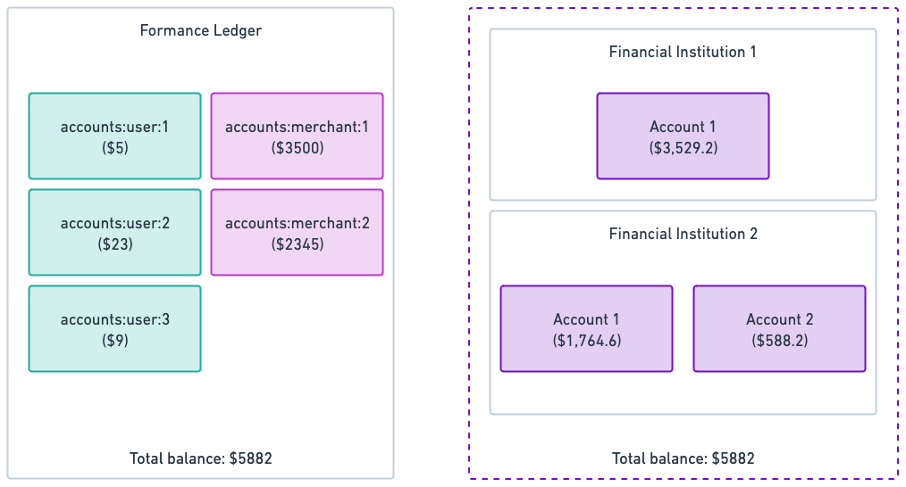

# What is Reconciliation?

When you're working on payment systems, most of the time, you're not managing the money yourself but rather representing money held by a financial institution in your internal system. You depend on an external financial institution to manage the funds on your behalf. This is because managing money is complex, highly regulated, and risky. Most companies prefer to outsource this to financial institutions specializing in managing money. 

In the meantime, you need to keep track of the money you manage within your ledgering systems. You need to know how much money you have, how much you owe, and how much you're owed. This part depends on your business model. In the Formance ecosystem, you model your money flows using the [Formance Ledger](../../ledger/index.mdx) or the [Formance Wallets](../../wallets/getting-started/index.mdx).

Reconciliation is the process of putting side by side the money managed by the Formance platform and the money managed by the external financial institution and **making sure that they match**.

In Formance Reconciliation, we provide two types of reconciliation:
- Account-based reconciliation
- Transaction-based reconciliation (**coming soon**)

Regardless of the reconciliation type, the produced artifact is a reconciliation report that shows the differences between the Formance Ledger and the external financial institution, if any. This report is then used by finance and audit teams to identify and fix the discrepancies.

## Account-based reconciliation

Account-based reconciliation is comparing the balances of a set of accounts in the Formance Ledger with those of another set of accounts in an external financial institution and ensuring that they match.

For the account-based reconciliation to succeed, the sum of the balances of the reconciled account set in the Formance Ledger must match the sum of balances of the reconciled accounts set in the external financial institution.

## Transaction-based reconciliation

:::warning
Transaction-based reconciliation is currently in development and not yet available. We'd love to hear about your use case. If you're interested, don't hesitate to get in touch with us on this topic.
:::