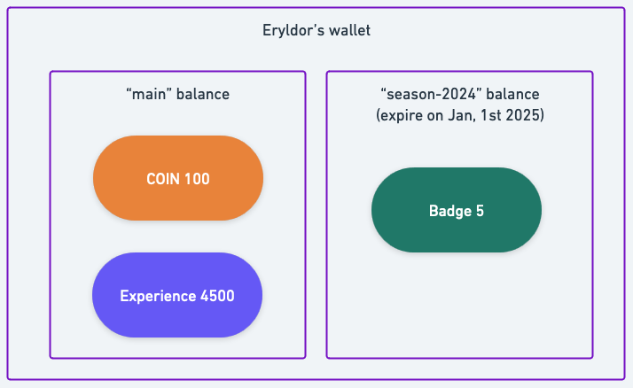

# Basic wallet operations

In this sections, you'll use Wallets to model the basics RPG game machanisms.

You'll manage the wallet of Eryldor, an elf mage living countless adventures!

## An introduction to Wallets

At its core, a **wallet** is a container of assets related to one entity. It can be used to store and manage any kind of assets, from money to items, and even more complex objects. 

In the context of Cones of Dunshires, a wallet is used to store the money, currencies, and points of a character.

A wallet is composed of **balances**. A balance is a mechanism to logically separate assets according to nature, usage, lifecycle or any other criteria. A balance can be seen as a sub-wallet, and can be used to store and manage a specific set of assets. A balance can expire. When a balance expires, its assets cannot be used anymore.

In Cones of Dunshires, Eryldor has a wallet with two balances: one for coins and experience points, and another for badges, which are earned in tournaments and expire when the tournament season ends.

Here is the structure of Eryldor's wallet.



## Creating Eryldor's wallet

:::info
Before starting, make sure you have followed the [prequisities](../../getting-started/fctl-quick-start.mdx) and that you're logged with the `fctl login` command.
:::

First you'll create Eryldor's wallet. You'll use the `fctl wallet create` command to create a wallet named `eryldor`.

```bash
fctl wallets create eryldor
```

You'll get a response like this:

```
You are about to create a wallet.
Do you want to continue [Y/n]: y
 SUCCESS  Wallet created successfully with ID: 9d21fd84-xxxx-yyyy-zzzz-250aaa73b374
```

:::info
Wallets come with a default balance named `main`. You can use it to store and manage assets without creating additional balances. Here, you'll use the `main` balance to store and manage the coins and experience points of Eryldor.
:::

### Create the `season-2024` balance

Now you'll create a balance named `season-2024` to store the badges of Eryldor. This balance will expire at the end of the tournament season 2024. Here it will expire on January 1st, 2025. 

:::tip
Feel free to adapt the expiration date to your needs.
:::

```bash
fctl wallets balances create season-2024 --name eryldor --expires-at "2025-01-01T00:00:00Z"
```

You'll get a response like this:

```
 SUCCESS  Balance created successfully with name: season-2024
```

### Inspecting Eryldor's wallet

You can inspect the wallet in the Formance Console. 

First open the console.
```bash
fctl ui
``` 

Then navigate to the Wallets section and select the `eryldor` wallet. You'll see the `main` balance and the `season-2024` balance as shown in the screenshot below.


:::tip Modeling with balances
A common use case for balances is to model vouchers, coupons, or any kind of assets that have a limited lifecycle. For example, you can create a balance for each voucher type, and set the expiration date to the end of the voucher validity period.
:::

## Crediting Eryldor with coins and experience points

After tremendous adventures, Eryldor managed to complete their first quest! As a well-deserved reward, they earned 10 COIN and 150 experience points. 

You'll use the `fctl wallets credit` command to credit Eryldor's wallet with these assets.

When you credit a wallet, you must specify where does the funds come from. Here, you'll specify that the funds come from the account `world`. `world` is a special account that represents the external world, and is used to introduce or remove assets from the system.

Note that you didn't specify a balance. When you don't specify a balance, the `main` balance is used by default as it is the primary balance of the wallet.

**Add the coins**

```bash
fctl wallets credit 10 COIN --name eryldor --source account=world
```

**Add the experience points**

```bash
fctl wallets credit 150 XP --name eryldor --source account=world
```

:::warning The `source` parameter
If you specify a source different from `world`, you'll get an `INSUFFICIENT_FUND` error. This is because you can only credit a wallet with assets coming from either the external world or another wallet.
:::

### Inspecting Eryldor's wallet

Let's inspect Eryldor's wallet in the Formance Console.

You'll see that the `main` balance contains 10 COIN and 150 XP, as shown in the screenshot below.


## Debiting Eryldor's wallet

Eryldor is now ready to buy a new spellbook! They found a rare spellbook for 5 COIN! It is a very good deal, so they decide to buy it.

You'll use the `fctl wallets debit` command to debit Eryldor's wallet with 5 COIN.

```bash
fctl wallet debit 5 COIN --name eryldor --destination account=world
```

You'll get a response like this:

```
 SUCCESS  Wallet debited successfully!
```

As we did for the credit, you must specify the destination of the funds. Here, you specify that the funds go to the account `world`. `world` being a special account that represents the external world, it can also be used to remove assets from the system.

### Inspecting Eryldor's wallet

Let's inspect Eryldor's wallet in the Formance Console.

You'll see that the `main` balance contains 5 COIN and 150 XP, as shown in the screenshot below.

