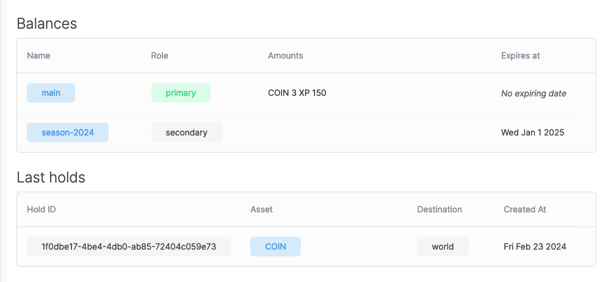

# Managing holds

In this section, you'll explore how to manage holds with Formance Wallets. You'll use the hold feature to model auction in the world of Cones of Dunshire.

## What is a hold?

A **hold** is a temporary reservation of funds. It's a way to ensure that funds are available when you need them. When you place a hold on a wallet, the funds are not available for spending, but they are still part of the wallet's balance.

After being placed, a hold can be **confirmed**, or it can be **canceled**. When a hold is confirmed, the funds are no longer available for spending and are transferred to the recipient's wallet. When a hold is canceled, the funds are released back to the wallet's balance.

## Placing a hold

While reading their brand new spellbook [acquired earlier](./basic-currency-management.mdx), Eryldor found the spell they were looking for. However, they need to buy an extra component to cast it. As it is a rare component, the only way they can get it is by participating in an auction. 

Fortuantely, at the auction-house, Eryldor found the component they need. They placed a bid of 2 COIN, and the auctioneer placed a hold on Eryldor's wallet to ensure that the funds are available when the auction ends, if Eryldor wins.

You'll act as the auctioneer and place a hold on Eryldor's wallet.

With `fctl`, you place a hold using the `wallets debit` command, as if you were debiting the wallet. To create a hold rather than a debit, you use the `--pending` flag.

```bash
fctl wallets debit 2 COIN --pending --name eryldor
```

You should see the following output:

```bash
You are about to debit a wallets.
Do you want to continue [Y/n]: y
 SUCCESS  Wallet debited successfully with hold id '1f0dbe17-4be4-4db0-ab85-72404c059e73'!
```

### Inspecting the hold

Let's inspect Eryldor's wallet in the Formance Console.

Open the Formance Console and navigate to the Wallets page. You should see a new hold on Eryldor's wallet.

```
fctl ui
```



Originally, assuming you've followed the previous tutorials, Eryldor's wallet had a balance of 5 COIN. After placing the hold, the wallet's balance became 3 COIN, and the hold was created with an amount of 2 COIN.

Now, should Erlydor win the auction? You choose!

## Confirming the hold

After the auction ends, Eryldor won the bid. The auctioneer will take the money from the hold placed earlier on Erlydores wallet.

To confirm the hold, you use the `fctl wallet hold confirm` command.

```
fctl wallets hold confirm <hold-id> --final
```

## Canceling the hold

If Eryldor didn't win the auction, the hold can be canceled to release the funds back to the wallet's balance.

To cancel the hold, you use the `fctl wallet hold void` command.

```
fctl wallets hold void <hold-id>
```

## Partially confirming the hold

In some cases, you may want to confirm only a portion of the hold. 

For example, Eryldor is ready to pay up to 4 coins for the auction. The auctioneer placed a hold of 4 coins on Eryldor's wallet. However, Eryldor won the auction with a bid of 3 coins. The auctioneer can confirm only 3 coins and cancel the remaining 1 coin.

First, you'll put a hold of 4 coins on Eryldor's wallet.

```bash
fctl wallets debit 4 COIN --pending --name eryldor
```

You should see the following output:

```bash
You are about to debit a wallets.
Do you want to continue [Y/n]: y
 SUCCESS  Wallet debited successfully with hold id '3af573f9-4c92-490b-9919-4848bf51fa33'!
```

:::info
If your wallet doesn't have enough funds, you can top it up using:

```
fctl wallets credit <amount> COIN --name eryldor --source account=world
```
:::

Now, you'll confirm only 3 coins of the hold.

```
fctl wallet hold confirm <hold-id> --amount 3 --final
```

You should see the following output:

```bash
 SUCCESS  Hold '3af573f9-4c92-490b-9919-4848bf51fa33' confirmed!
```

**TODO: Add screenshots when hold information are integrated in the UI.**