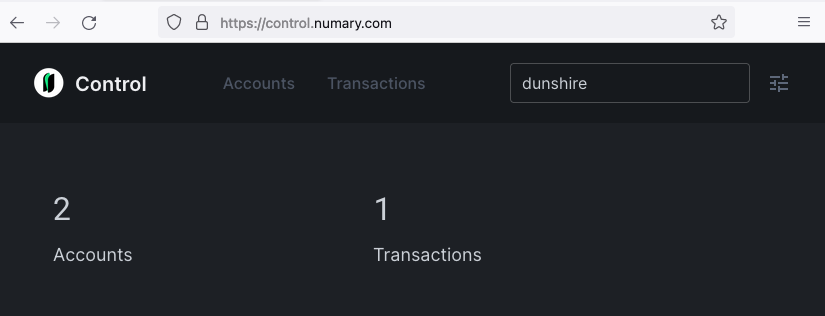

# Checking balances

In the previous step you introduced money into the `dunshire` ledger. Now we want to verify that everything is as it should be. We want to know: Did the `@centralbank` account get created, and does it have a balance of 100 coins?

To verify, visit [https://control.numary.com](https://control.numary.com), which is a dashboard hosted by your locally running Numary Ledger service.

:::info
The app dashboard at [https://control.numary.com](https://control.numary.com) is a clever webpage that requests data from your local Numary Ledger service via calls to localhost. No one else can see what you see on that page, this data is _only_ being served locally.
:::

The dashboard landing page gives an overview of activity, and should look like this:



## Checking accounts

Clicking on the accounts tab at the top (or [this link](https://control.numary.com/accounts)) will take you to the accounts overview page. This page lists all the accounts Numary Ledger knows about. Right now, that should be only `@world` and `@centralbank`:


## Checking transactions and balances

Let's verify that `@centralbank` does indeed hold 100 coin transferred from `@world`. Click on `centralbank` (or [this link](https://control.numary.com/accounts/centralbank)) to see details on that account.


Here we can see that indeed, `@centralbank` holds a balance of 100 coin, and that it was received from `@world`. Perfect!

## Troubleshooting

### Failed to connect

Are getting a "**Failed to connect to the ledger**" error like this?


This indicates that either you haven't [started the Numary Ledger service](start-the-server), or you did start it but somehow it's running on a different port than expected. It could also mean that you already have a different service running on the same port Numary Ledger wants to use. If you changed the default port because of a conflict, you can tell Numary Control what port you used instead.

By default, Numary Ledger uses port 3068 to host the built-in dashboard.

If you need to specify a different port for Numary Ledger, you can do at the command line. For example, to use port 4242:

```shell
numary server start --ui.http.bind_address localhost:4242
```

### No accounts or different accounts

Alternately, if you are seeing the dashboard, but it contains unexpected data, then you have probably already been experimenting with Numary Ledger on your computer, and just don't have the right ledger selected. Click on the box in the upper-right hand corner to select the `dunshire` ledger.

## Next steps

Next, let's start handing out some coin to our users.